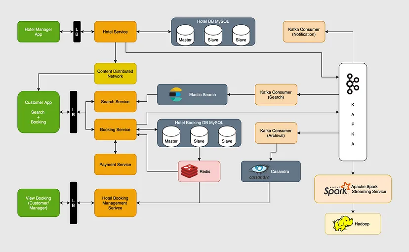

# Requirement Analysis in Software Development.

This repository contains documentation for the requirement analysis process in software development.

## What is Requirement Analysis?

Requirement Analysis is a critical phase in the software development lifecycle, focusing on understanding, gathering, and defining the needs and expectations of stakeholders for a project. This process ensures that the final product aligns with user requirements and business goals.

## Why is Requirement Analysis Important?

- Clear Understanding of Needs
  It helps identify and define the actual needs of users and stakeholders, preventing misunderstandings and misinterpretations. This clarity ensures the project delivers the right functionality.

- Prevents Scope Creep
  By defining clear and detailed requirements, Requirement Analysis sets boundaries for the project scope. This reduces the risk of unexpected changes that can lead to delays, cost overruns, and resource strain.

- Enhances Communication
  It facilitates better communication among stakeholders, developers, and project managers. A shared understanding of the requirements ensures everyone is aligned, reducing conflicts and ambiguities.

- Cost and Time Efficiency
  Identifying requirements early prevents costly changes later in the development process. Clear requirements reduce the need for extensive rework, saving time and resources.

- Improves Quality
  Detailed and validated requirements serve as a blueprint for design, development, and testing. This ensures that the final product aligns with user expectations, enhancing customer satisfaction and product quality.

- Risk Mitigation
  Analyzing requirements helps uncover potential risks and constraints at an early stage. Addressing these proactively reduces the chances of project failure or unforeseen challenges.

- Facilitates Testing and Validation
  Clear requirements provide the basis for creating test cases and validating the system. This ensures that the final product meets all specified needs and performs as expected.

- Supports Decision-Making
  Well-documented requirements help stakeholders make informed decisions throughout the project. They serve as a reference point for evaluating progress and determining whether changes are justified.

## Key Activities in Requirement Analysis

---

#### **1. Requirement Gathering**

- **Objective**: Collect information from various sources to understand stakeholder needs.
- **Methods**:
  - Stakeholder interviews
  - Surveys and questionnaires
  - Workshops and brainstorming sessions
  - Document analysis (existing systems, business plans)
- **Outcome**: Initial list of requirements, often broad and unstructured.

---

#### **2. Requirement Elicitation**

- **Objective**: Actively engage stakeholders to uncover detailed, explicit, and implicit requirements.
- **Techniques**:
  - Use case development
  - Prototyping and mockups
  - Focus groups
  - Observations and contextual inquiries
- **Outcome**: A refined set of requirements, including insights that may not have been initially obvious.

---

#### **3. Requirement Documentation**

- **Objective**: Clearly document all gathered and elicited requirements in an organized manner.
- **Key Components**:
  - Functional and non-functional requirements
  - User stories or use cases
  - System specifications
  - Diagrams (like flowcharts or entity-relationship diagrams)
- **Outcome**: A Requirements Specification Document that serves as a reference throughout the project lifecycle.

---

#### **4. Requirement Analysis and Modeling**

- **Objective**: Analyze the documented requirements to ensure they are clear, complete, and feasible.
- **Activities**:
  - Identify and resolve conflicts between requirements
  - Prioritize requirements based on business value and feasibility
  - Develop models (e.g., data flow diagrams, process models)
- **Outcome**: A structured set of validated and prioritized requirements, often visualized through models for better understanding.

---

#### **5. Requirement Validation**

- **Objective**: Ensure that the documented requirements accurately reflect stakeholder needs and are feasible.
- **Validation Techniques**:
  - Requirement reviews and walkthroughs
  - Prototyping for feedback
  - Test case creation to ensure testability
  - Stakeholder approval and sign-off
- **Outcome**: Finalized and approved requirements that form the basis for design and development, minimizing the risk of errors or scope changes later in the project.

---

### Types of Requirements

#### **1. Functional Requirements**

**Definition**:  
Functional requirements define the specific behaviors, actions, and functions of a system. They describe what the system should do, focusing on the core features and operations.

**Examples for a Booking Management Project**:

- **User Authentication**:
  - Users must be able to register and log in to the system using an email and password.
- **Booking Creation and Management**:
  - Users should be able to create, modify, and cancel bookings.
- **Payment Processing**:
  - The system should support secure online payments using credit cards or PayPal.
- **Notification System**:
  - The system must send email notifications for booking confirmations and reminders.

---

#### **2. Non-functional Requirements**

**Definition**:  
Non-functional requirements define the system's operational characteristics and constraints. They focus on how the system performs rather than what it does.

**Examples for a Booking Management Project**:

- **Performance**:
  - The system should process booking requests within 3 seconds under normal load.
- **Scalability**:
  - The system must support up to 10,000 concurrent users without performance degradation.
- **Security**:
  - All user data must be encrypted both in transit and at rest.
- **Availability**:
  - The system should have 99.9% uptime, ensuring continuous service availability.
- **Usability**:
  - The interface should be user-friendly and accessible, adhering to WCAG 2.1 guidelines.

---

### Use Case Diagrams

#### **What are Use Case Diagrams?**

Use Case Diagrams are a type of behavioral diagram in Unified Modeling Language (UML) that illustrate how users (actors) interact with a system. They represent the functionality provided by the system and the relationship between users and these functionalities.

#### **Benefits of Use Case Diagrams:**

- **Clear Communication**: Simplifies complex system functionalities into easy-to-understand visuals.
- **User-Centric Design**: Focuses on user interactions and ensures user requirements are met.
- **Identifies System Scope**: Defines boundaries by showing what the system does and who interacts with it.
- **Supports Requirement Validation**: Helps in verifying that all user needs are addressed.

---

#### **Booking System Use Case Diagram**

---

### **Actors**:

- **Customer**: Books, modifies, and cancels reservations.
- **Admin**: Manages bookings and oversees system operations.
- **Payment Gateway**: Handles payment processing securely.

### **Use Cases**:

1. **Register/Login**: Allows customers to create an account or sign in.
2. **Create Booking**: Customers can create new reservations.
3. **Modify Booking**: Customers can update reservation details.
4. **Cancel Booking**: Customers can cancel existing reservations.
5. **Process Payment**: Facilitates secure payment transactions.
6. **Send Notifications**: Sends confirmation emails or reminders.
7. **Manage Bookings (Admin)**: Admin can view and modify all bookings.

---

### **Acceptance Criteria**

#### **What are Acceptance Criteria?**

Acceptance criteria are a set of predefined conditions that must be met for a software feature or functionality to be considered complete and acceptable by stakeholders. They provide a clear, concise, and measurable way to determine whether the implementation meets business and user requirements.

#### **Importance of Acceptance Criteria in Requirement Analysis:**

- **Ensures Clear Expectations:** Defines exactly what is required for the feature to be accepted.
- **Facilitates Testing:** Provides a basis for creating test cases and conducting validation.
- **Improves Communication:** Aligns stakeholders, developers, and testers on expected outcomes.
- **Reduces Scope Creep:** Prevents changes by clearly outlining what is and isn't included.

---

#### **Example: Acceptance Criteria for the Checkout Feature**

**Feature:** Checkout Process in the Booking Management System

**Acceptance Criteria:**

1. **Successful Payment Processing:**

   - Users can pay using credit cards or PayPal.
   - Payment is processed securely with encryption.

2. **Booking Confirmation:**

   - A confirmation email is sent to the user after successful payment.
   - The confirmation includes booking details (date, time, and reference number).

3. **Error Handling:**

   - The system displays an error message if the payment fails.
   - Failed transactions are logged for admin review.

4. **User Experience:**
   - The payment process completes within 5 seconds.
   - The user is redirected to a "Thank You" page after payment.
